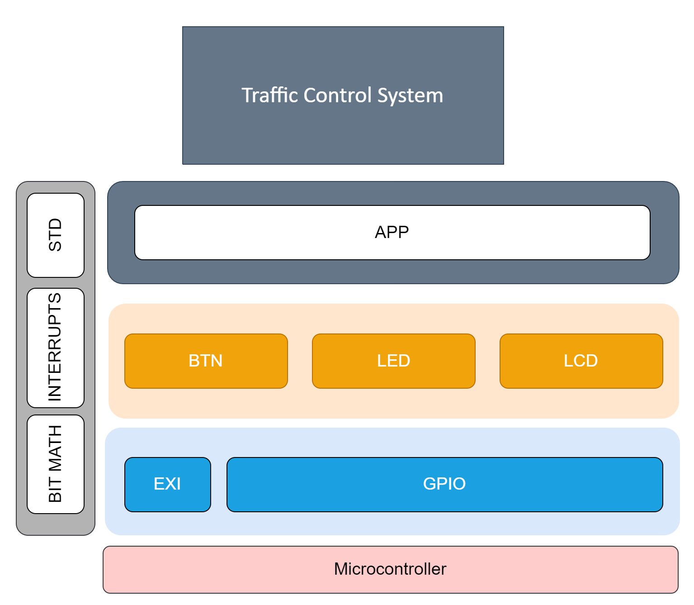

# EME - Egypt Make Electronics
## Team GUCALEX

### Team Members:
- Hossam Elwahsh - [Github](https://github.com/HossamElwahsh)
- Mahmoud abdrabo - [Github](https://github.com/Mahmoud-Abdrabo)
- Ahmed Sakr
- Omar Mohsen

### AVR Interfacing Project
#### AVR-Based Traffic Control System with Pedestrian Crossing

#### Description:
> This project involves using an AVR microcontroller to simulate a traffic control system at an intersection. It manages traffic lights for vehicles and pedestrians, with a button allowing pedestrians to request safe crossing. The system utilizes interrupts, state machine logic, and real-time operation for efficient traffic flow and pedestrian safety. It's a learning opportunity for microcontroller programming and offers potential enhancements like sensor integration and wireless communication.

### Video Showcase 👉 [Video](Docs/User_Stories_Showcase.mp4)

### Layered Architecture
